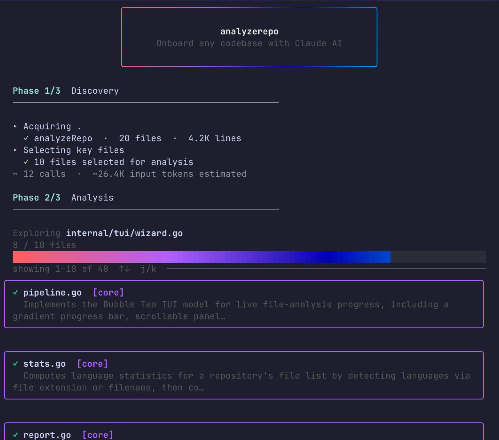

# analyzerepo

**Understand any codebase in minutes — and make Claude Code actually useful from day one.**

`analyzerepo` points Claude AI at a GitHub repository or local codebase and produces three ready-to-use Markdown files: an onboarding guide for new contributors, a per-file analysis with prioritized improvement suggestions, and a `CLAUDE.md` that gives Claude Code the context it needs to be genuinely helpful instead of generically cautious.

```
analyzerepo https://github.com/you/your-project
```

---



---

## Quick start

**Prerequisites:** Either an `ANTHROPIC_API_KEY` environment variable or the [Claude CLI](https://claude.ai/download) installed.

**Install:** Download the [latest binary](https://github.com/rlnorthcutt/analyzeRepo/raw/refs/heads/main/analyzeRepo), make it executable, and put it on your `PATH`. No runtime or language install required.

```bash
# Analyze a GitHub repo
analyzerepo https://github.com/charmbracelet/bubbletea

# Analyze a local project
analyzerepo ./my-project

# Choose which reports to generate
analyzerepo ./my-project --reports onboarding,claude

# Write output to a specific directory
analyzerepo ./my-project --output ./docs/ai
```

The first run launches an interactive wizard. Every option can also be set via flags for scripted use.

---

## Why this exists

Adding Claude Code to a repo you don't own — or haven't touched in months — is frustrating. Claude doesn't know the architecture, the conventions, or what's broken. New contributors face the same problem from the human side.

`analyzerepo` solves both at once:

| Problem | What it produces |
|---------|-----------------|
| Claude Code lacks repo context | `CLAUDE.md` — architectural overview, key files, conventions |
| New devs don't know where to start | `ONBOARDING.md` — executive summary, stats, file tree, doc library |
| Tech debt is invisible | `ANALYSIS.md` — per-file summaries, roles, and actionable suggestions |

---

## What you get

### `ONBOARDING.md`
A human-readable guide that covers what the project does, language breakdown, total file/line counts, a documentation library (all `.md` files mapped to their purpose), and a full file tree. Hand this to a new contributor on day one.

### `ANALYSIS.md`
Every analyzed file gets a summary, a role classification (`entrypoint`, `core`, `config`, `util`, `test`, `docs`, `build`), and structured improvement suggestions. Each suggestion includes:

- **type** — `improvement`, `refactor`, `security`, `performance`, or `docs`
- **file** — the specific file to change
- **effort** — `trivial`, `small`, `medium`, or `large`
- **done_when** — a single verifiable completion condition
- **blocks** — what downstream work this unblocks *(when relevant)*

This format is designed so you can paste a suggestion directly into a Claude Code prompt and get a working implementation.

### `CLAUDE.md`
A project-specific context file that Claude Code reads automatically. It describes the architecture, key entry points, conventions, and what to watch out for. Drop it in your repo root and every Claude Code session starts informed.

---

## How it works

```
Phase 1: Discovery
  ✓ Clone or locate the repository
  ✓ Walk the file tree (ignores build artifacts, lock files, binaries)
  ✓ Select the most important files (up to 20 via Claude, or --full for all)

Phase 2: Analysis
  ✓ Send each file to Claude with a structured prompt
  ✓ Receive role, summary, and improvement suggestions per file
  ✓ Live scrollable viewport shows results as they arrive

Phase 3: Generation
  ✓ Write ANALYSIS.md, ONBOARDING.md, and/or CLAUDE.md
  ✓ Print clickable links to each output file
```

Token usage is estimated before the run starts and reported (calls / tokens in / tokens out) when it finishes.

---

## CLI reference

```
analyzerepo [source] [flags]

Arguments:
  source    GitHub URL (https://github.com/…) or local path

Flags:
  --reports string   Comma-separated reports to generate (default: all)
                     onboarding, improvement, claude, all
  --full             Analyze every file instead of Claude-selected key files
  --output string    Output directory (default: current directory)
  --non-interactive  Skip the wizard; use flags and defaults
  --dry-run          Run without calling Claude (for testing)
  -h, --help         Help
```

### Report types

| Flag value | Output file | Contents |
|------------|-------------|----------|
| `onboarding` | `ONBOARDING.md` | Executive summary, stats, file tree, doc library |
| `improvement` | `ANALYSIS.md` | Per-file summaries, roles, suggestions |
| `claude` | `CLAUDE.md` | Context file for Claude Code |
| `all` | All three | Everything above |

---

## Claude backend

`analyzerepo` automatically detects how to reach Claude:

1. **Anthropic API** — set `ANTHROPIC_API_KEY` in your environment
2. **Claude CLI** — uses your existing `claude` installation if the API key isn't set

No extra configuration needed. The tool picks whichever is available.

---

## Using the outputs

### Get Claude Code up to speed instantly
```bash
analyzerepo . --reports claude
# Then start Claude Code — it reads CLAUDE.md automatically
claude
```

### Onboard a new contributor
```bash
analyzerepo https://github.com/org/repo --reports onboarding
# Share ONBOARDING.md — it covers what the codebase does and how it's structured
```

### Work through improvement suggestions with Claude Code
```bash
analyzerepo . --reports improvement
# Open ANALYSIS.md, find a suggestion, paste it into Claude Code:
# "Implement this suggestion: [paste suggestion block]"
```

### Full run before a big refactor
```bash
analyzerepo . --full --output ./.ai-docs
# Analyze every file and write all three reports to .ai-docs/
```

---

## What files are analyzed

`analyzerepo` automatically skips files that aren't useful for AI analysis:

- **Directories:** `node_modules`, `.git`, `vendor`, `dist`, `build`, `.venv`, and similar
- **Extensions:** images, compiled binaries, archives, fonts, media, lock files
- **Filenames:** `.env*`, `package-lock.json`, `yarn.lock`, `Cargo.lock`, and similar

Everything else is fair game. Use `--full` to include all files; omit it to let Claude pick the most structurally significant ones (recommended for large repos).

---

## Development

Go 1.21+ is required to build from source.

```bash
git clone https://github.com/rlnorthcutt/analyzeRepo
cd analyzeRepo
go build ./...
go test ./...
```

Test coverage spans all core packages: file filtering, language detection, report generation, token estimation, and TUI viewport logic.

```bash
# Try it without making any Claude calls
go run . . --dry-run
```

---

## License

MIT — see [LICENSE](LICENSE).
